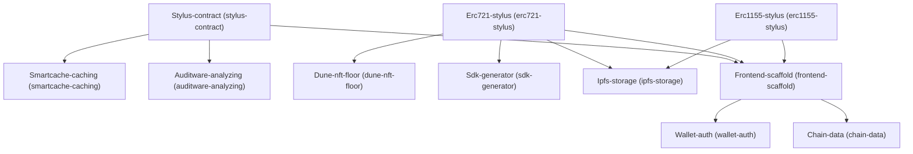

# Architecture

## Dependency Graph

## Execution / Implementation Order

1. **Stylus-contract** (`eef56ff1`)
2. **Erc721-stylus** (`c8f520e5`)
3. **Erc1155-stylus** (`2f3fff28`)
4. **Smartcache-caching** (`b371f1c1`)
5. **Auditware-analyzing** (`4bc51bb0`)
6. **Dune-nft-floor** (`c95a8b0e`)
7. **Sdk-generator** (`2745e939`)
8. **Ipfs-storage** (`6639bff9`)
9. **Frontend-scaffold** (`233653bb`)
10. **Wallet-auth** (`1e7b3726`)
11. **Chain-data** (`60c9eed4`)
