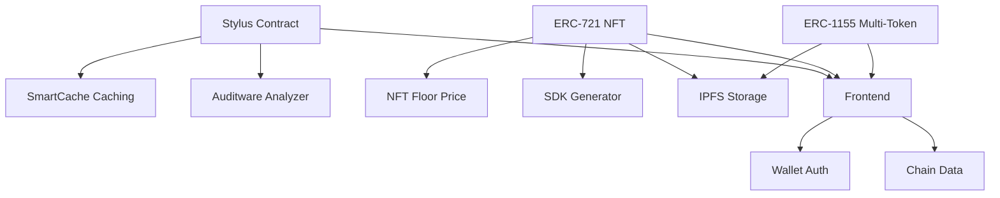

# My Dapp

> A Web3 application - composed with [N]skills

**Network**: Arbitrum Sepolia (Chain ID: 421614) — Testnet
**Keywords**: web3, dapp

---

## Architecture

## Components

| Component | Type | Category | User Prompt |
|-----------|------|----------|-------------|
| Stylus Contract | `stylus-contract` | contracts | (none) |
| ERC-721 NFT | `erc721-stylus` | contracts | (none) |
| ERC-1155 Multi-Token | `erc1155-stylus` | contracts | (none) |
| SmartCache Caching | `smartcache-caching` | contracts | (none) |
| Auditware Analyzer | `auditware-analyzing` | contracts | (none) |
| NFT Floor Price | `dune-nft-floor` | analytics | (none) |
| SDK Generator | `sdk-generator` | app | (none) |
| IPFS Storage | `ipfs-storage` | app | (none) |
| Frontend | `frontend-scaffold` | app | (none) |
| Wallet Auth | `wallet-auth` | app | (none) |
| Chain Data | `chain-data` | app | (none) |

## Implementation Order

Build the project in this order (respects dependencies):

1. **Stylus Contract** (`stylus-contract`) — see `.cradle/components/stylus-contract--eef56ff1.md`
2. **ERC-721 NFT** (`erc721-stylus`) — see `.cradle/components/erc721-stylus--c8f520e5.md`
3. **ERC-1155 Multi-Token** (`erc1155-stylus`) — see `.cradle/components/erc1155-stylus--2f3fff28.md`
4. **SmartCache Caching** (`smartcache-caching`) — see `.cradle/components/smartcache-caching--b371f1c1.md`
5. **Auditware Analyzer** (`auditware-analyzing`) — see `.cradle/components/auditware-analyzing--4bc51bb0.md`
6. **NFT Floor Price** (`dune-nft-floor`) — see `.cradle/components/dune-nft-floor--c95a8b0e.md`
7. **SDK Generator** (`sdk-generator`) — see `.cradle/components/sdk-generator--2745e939.md`
8. **IPFS Storage** (`ipfs-storage`) — see `.cradle/components/ipfs-storage--6639bff9.md`
9. **Frontend** (`frontend-scaffold`) — see `.cradle/components/frontend-scaffold--233653bb.md`
10. **Wallet Auth** (`wallet-auth`) — see `.cradle/components/wallet-auth--1e7b3726.md`
11. **Chain Data** (`chain-data`) — see `.cradle/components/chain-data--60c9eed4.md`

## Environment Variables

| Key | Description | Required | Default |
|-----|-------------|----------|---------|
| `DEPLOYER_PRIVATE_KEY` | Private key for contract deployment | Yes |  |
| `STYLUS_RPC_URL` | Arbitrum RPC URL (default: Arbitrum Sepolia) | No | https://sepolia-rollup.arbitrum.io/rpc |
| `NEXT_PUBLIC_NFT_ADDRESS` | Deployed ERC721 NFT address | No |  |
| `PRIVATE_KEY` | Private key for deployment and transactions | Yes |  |
| `ERC721_DEPLOYMENT_API_URL` | URL of the ERC721 deployment API | No | http://localhost:4001 |
| `NEXT_PUBLIC_ERC1155_ADDRESS` | Deployed ERC1155 multi-token address | No |  |
| `ERC1155_DEPLOYMENT_API_URL` | URL of the ERC1155 deployment API | No | http://localhost:4002 |
| `DUNE_API_KEY` | Dune Analytics API key for blockchain data queries | Yes |  |
| `PINATA_JWT` | Pinata JWT token | Yes |  |
| `NEXT_PUBLIC_PINATA_GATEWAY` | Pinata gateway URL | No | https://gateway.pinata.cloud |
| `NEXT_PUBLIC_WALLETCONNECT_PROJECT_ID` | WalletConnect Cloud project ID for wallet connections | Yes |  |
| `NEXT_PUBLIC_APP_NAME` | Application name displayed in wallet dialogs | No | My DApp |
| `NEXT_PUBLIC_ALCHEMY_API_KEY` | Alchemy API key for data fetching | Yes |  |

## Key Dependencies

| Package | Version |
|---------|---------|
| `next` | `^14.2.0` |
| `react` | `^18.3.0` |
| `react-dom` | `^18.3.0` |
| `wagmi` | `^2.12.0` |
| `viem` | `^2.21.0` |
| `@tanstack/react-query` | `^5.51.0` |
| `@rainbow-me/rainbowkit` | `^2.1.0` |
| `clsx` | `^2.1.0` |
| `tailwind-merge` | `^2.2.0` |
| `ethers` | `^6.13.0` |
| `lucide-react` | `^0.400.0` |
| `@types/node` | `^20.0.0` |
| `@types/react` | `^18.3.0` |
| `@types/react-dom` | `^18.3.0` |
| `typescript` | `^5.4.0` |
| `eslint` | `^8.57.0` |
| `eslint-config-next` | `^14.2.0` |
| `tailwindcss` | `^3.4.0` |
| `postcss` | `^8.4.0` |
| `autoprefixer` | `^10.4.0` |

## Detailed Component Specs

- [Stylus Contract](.cradle/components/stylus-contract--eef56ff1.md)
- [ERC-721 NFT](.cradle/components/erc721-stylus--c8f520e5.md)
- [ERC-1155 Multi-Token](.cradle/components/erc1155-stylus--2f3fff28.md)
- [SmartCache Caching](.cradle/components/smartcache-caching--b371f1c1.md)
- [Auditware Analyzer](.cradle/components/auditware-analyzing--4bc51bb0.md)
- [NFT Floor Price](.cradle/components/dune-nft-floor--c95a8b0e.md)
- [SDK Generator](.cradle/components/sdk-generator--2745e939.md)
- [IPFS Storage](.cradle/components/ipfs-storage--6639bff9.md)
- [Frontend](.cradle/components/frontend-scaffold--233653bb.md)
- [Wallet Auth](.cradle/components/wallet-auth--1e7b3726.md)
- [Chain Data](.cradle/components/chain-data--60c9eed4.md)

## Additional Context

- [Project Configuration](.cradle/project.md)
- [Full Architecture Details](.cradle/architecture.md)
- [All Environment Variables](.cradle/environment.md)
- [Verified Dependencies](.cradle/dependencies.md)
- [Scripts Reference](.cradle/scripts.md)
- [Integration Map](.cradle/integration-map.md)

---

*Generated by [[N]skills](https://cradle.dev) — Compose N skills for your Web3 project.*
